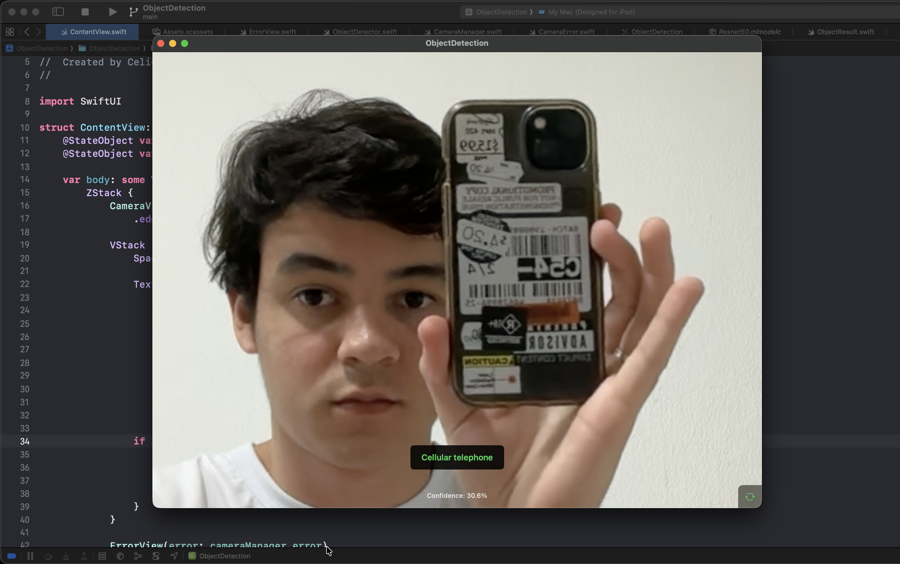

# ObjectDetection

A real-time object detection iOS app that uses your device's camera to identify and classify objects using machine learning.

## How it works

The app follows a straightforward pipeline from camera input to machine learning results:

1. **Camera Capture** - AVFoundation captures live video frames from the device camera
2. **Frame Processing** - Each video frame (CVPixelBuffer) is extracted from the camera stream
3. **Vision Framework** - Frames are processed through Apple's Vision framework using VNCoreMLRequest
4. **CoreML Inference** - The ResNet50 model analyzes the frame and generates classification predictions
5. **Results Display** - Object labels and confidence scores are displayed over the live camera feed

## Tech Stack

- **AVFoundation** - Camera management and video capture
- **Vision Framework** - Image processing and CoreML integration
- **CoreML** - Machine learning inference on device
- **ResNet50** - Pre-trained convolutional neural network for object classification
- **SwiftUI** - User interface and app architecture
- **Swift Concurrency** - Async/await for camera operations

## Requirements

- iOS 17.0+ (for better experience)
- Device with camera
- Xcode 16.0+